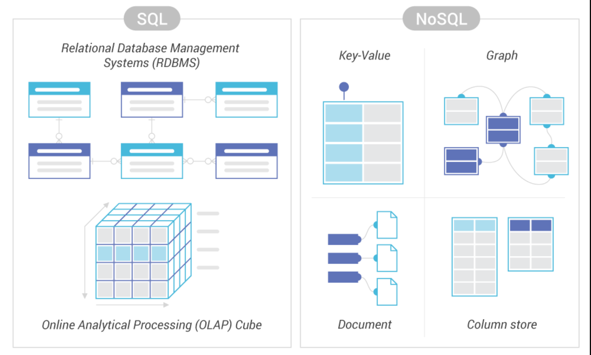

# Порівняння між SQL і NoSQL базами даних

### Реляційна база даних (SQL)

**Реляційна база даних (SQL)** – база, у котрій дані зберігаються у форматі таблиць, вони суворо структуровані та пов’язані одна з одною. У таблиці є рядки (rows) та стовпчики (columns), кожен є записом, а стовпчик – поле з призначеним йому типом даних. У кожній комірці інформація записана згідно шаблону.

### Нереляційна база даних (NoSQL)

**Нереляційна база даних (NoSQL)** – зберігає дані без чітких зв’язків між собою та без чіткої структури. Замість структурованих таблиць, всередині бази знаходиться безліч різнорідних документів, в тому числі і зображення, відео та навіть публікації у соціальних мережах. На відміну від реляційних БД, NoSQL бази не підтримують SQL запити.

### Що краще SQL чи NoSQL?

Рішення про те, який тип бази даних використовувати – SQL чи NoSQL – залежатиме від конкретних потреб і вимог проекту. Наприклад, якщо вам потрібна швидка, масштабована та надійна база даних для веб-додатків, система NoSQL може бути кращою.

З іншого боку, якщо ваша програма вимагає складних запитів даних і підтримки транзакцій, система SQL може бути кращим вибором. Зрештою, не існує універсального рішення – все зводиться до того, що вам потрібно від вашої бази даних і який тип системи може забезпечити це найефективнішим способом.

Перш ніж прийняти рішення, краще ретельно вивчити обидва варіанти.
