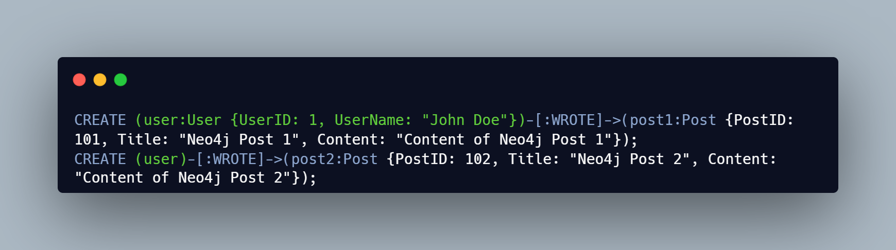

# Порівняння між SQL і NoSQL базами даних

#### Виконали:

**Юхименко** Станіслав ІМ-23
[_telegram: @stas_yukhymenko_](https://t.me/stas_yukhymenko)

**Юрченко** Тарас ІМ-23
[_telegram: @Yurchenko228_](https://t.me/Yurchenko228)

У 1970 р. реляційна модель для баз даних, модель для ефективної організації та зберігання даних у таблицях у структурі стовпців і рядків, була викладена д-ром Едгаром Коддом у його знаковій статті «A Relational Model of Data for Large Shared Data Banks." До 1974 року IBM розробила System R, перший проект для реалізації реляційної моделі для зберігання даних, і вони розробили SQL як мову для взаємодії з цими реляційними базами даних.

Протягом багатьох років були розроблені нові стандарти для SQL, і Oracle, IBM і Microsoft розробили системи керування реляційними базами даних (RDBMS) для ефективного, безпечного та зручного використання SQL для взаємодії з базами даних SQL.

Далі мови з відкритим вихідним кодом, такі як MySQL, почали робити SQL і реляційні бази даних більш доступними для населення. SQL тепер широко доступний як у фізичних, так і в хмарних системах, таких як AWS, Azure і Google Cloud.

### Реляційна база даних (SQL)

**Реляційна база даних (SQL)** – база, у котрій дані зберігаються у форматі таблиць, вони суворо структуровані та пов’язані одна з одною. У таблиці є рядки (rows) та стовпчики (columns), кожен є записом, а стовпчик – поле з призначеним йому типом даних. У кожній комірці інформація записана згідно шаблону.

### Нереляційна база даних (NoSQL)

**Нереляційна база даних (NoSQL)** – зберігає дані без чітких зв’язків між собою та без чіткої структури. Замість структурованих таблиць, всередині бази знаходиться безліч різнорідних документів, в тому числі і зображення, відео та навіть публікації у соціальних мережах. На відміну від реляційних БД, NoSQL бази не підтримують SQL запити.

### Що краще SQL чи NoSQL?

Рішення про те, який тип бази даних використовувати – SQL чи NoSQL – залежатиме від конкретних потреб і вимог проекту. Наприклад, якщо вам потрібна швидка, масштабована та надійна база даних для веб-додатків, система NoSQL може бути кращою.

З іншого боку, якщо ваша програма вимагає складних запитів даних і підтримки транзакцій, система SQL може бути кращим вибором. Зрештою, не існує універсального рішення – все зводиться до того, що вам потрібно від вашої бази даних і який тип системи може забезпечити це найефективнішим способом.

Перш ніж прийняти рішення, краще ретельно вивчити обидва варіанти.

|                                                   **SQL**                                                    |                               **NoSQL**                               |
| :----------------------------------------------------------------------------------------------------------: | :-------------------------------------------------------------------: |
|                                Розшифровується як мова структурованих запитів                                |                    Розшифровується як Not Only SQL                    |
|                              Реляційна система управління базами даних (СУРБД)                               |              Нереляційна система керування базами даних               |
|                     Підходить для структурованих даних із заздалегідь визначеною схемою                      |      Підходить для неструктурованих і напівструктурованих даних       |
|                             Дані зберігаються в таблицях зі стовпцями і рядками                              |             Дані зберігаються в колекціях або документах              |
| Дотримується властивостей ACID (атомність, узгодженість, ізоляція, довговічність) для керування транзакціями |              Не обов’язково відповідає властивостям ACID              |
|                                       Підтримує JOIN і складні запити                                        |                  Не підтримує JOIN і складні запити                   |
|                                  Використовує нормалізовану структуру даних                                  |              Використовує деноралізовану структуру даних              |
|                     Потрібне вертикальне масштабування для обробки великих обсягів даних                     | Горизонтальне масштабування можливе для обробки великих обсягів даних |
|                    Приклади: MySQL, PostgreSQL, Oracle, SQL Server, Microsoft SQL Server                     |    Приклади: MongoDB, Cassandra, Couchbase, Amazon DynamoDB, Redis    |

### Створення простої бази даних MySQL, PostgreSQL, Microsoft SQL Server

#### SQL бази даних (MySQL, PostgreSQL, Microsoft SQL Server):

**1. Структура та Схема:**

- SQL бази даних вимагають жорсткої схеми, де зазначаються типи даних та зв'язки між таблицями.
- Це забезпечує консистентність та дозволяє використовувати зовнішні ключі для забезпечення цілісності даних.

**2. Мова Запитів:**

- Використовується мова SQL для взаємодії з базою даних, що надає стандартний спосіб виконання операцій, таких як SELECT, INSERT, UPDATE та DELETE.

**3. Транзакції:**

- SQL бази даних підтримують транзакції, що дозволяє здійснювати групу операцій як єдину атомарну операцію.

**4. Гнучкість в Запитах:**

- Для складних операцій та аналітичних запитів SQL бази даних можуть бути більш гнучкими.

### Створення бази даних MongoDB

### Створення бази даних Cassandra

#### NoSQL бази даних (MongoDB, Cassandra):

**1. Модель даних:**

- MongoDB: Використовує документну модель даних, де дані зберігаються у вигляді документів у форматі BSON (бінарний JSON). Кожен документ є JSON-подібним об'єктом з полями та значеннями.

- Cassandra: Використовує ширококолоночну модель даних. Дані організовані у вигляді широких рядків, що містять багато колонок, і кожен стовпець може мати свій власний час життя.

**2. Масштабованість:**

- MongoDB: Горизонтально масштабований, тобто може легко розширюватися на багато серверів.

- Cassandra: Також спроектований для горизонтального масштабування, забезпечуючи високу доступність та стійкість до відмов.

**3. Консистентність та Доступність:**

- MongoDB: Гарантує послідовність даних в рамках одного вузла (консистентність) та гнучку доступність.

- Cassandra: Більше акцентується на доступності та партиціонованості (AP) в термінах CAP-теорії, надаючи широкі можливості для масштабованості та високої доступності.

**4. Мова запитів:**

- MongoDB: Використовує мову запитів на основі JSON, відому як мова запитів MongoDB (Mongo Query Language).
- Cassandra: Використовує мову CQL (Cassandra Query Language), яка схожа на структуровану мову SQL.

**5. Транзакції:**

- MongoDB: Підтримує транзакції на рівні колекцій у режимі стійкості до відмов (ACID).
- Cassandra: Підтримка транзакцій обмежена, і Cassandra частіше використовує підходи, спрямовані на забезпечення високої доступності.

**6. Застосування:**

- MongoDB: Зазвичай використовується для сценаріїв, де важлива гнучкість структури даних та швидкість розробки.
- Cassandra: Зазвичай використовується для великих систем зберігання даних з вимогами до високої доступності та масштабованості.

### Створення бази даних Neo4j

#### Графові бази даних (Neo4j):

**1. Зв'язки та Граф:**

- Neo4j орієнтований на графи та використовує мову Cypher для вираження графових операцій.

**2. Глибокі Запити:**

- Графові бази даних ідеально підходять для глибокого аналізу зв'язків між даними та здійснення складних запитів графової структури.

**3. Гнучкість в Запитах:**

- Графові бази даних забезпечують гнучкість у вираженні та виконанні складних графових запитів.

### Створення бази даних Apache HBase

#### Wide-Column Store бази даних (Apache HBase):

**1. Широкі Колонки:**

- Apache HBase використовує модель з широкими колонками, що робить його підходящим для великого обсягу розподілених даних.

**2. Горизонтальна Масштабованість:**

- Як і NoSQL рішення, HBase легко масштабується горизонтально за допомогою додавання нових вузлів.

**3. Висока Доступність:**

- Має високу доступність та стійкість до відмов завдяки своїй розподіленій архітектурі.

### Коли використовувати SQL чи NoSQL?

Це насправді зводиться до типу програми, яку ви створюєте, і вимог до даних, які вона передбачає. Розуміння унікальних особливостей кожної бази даних допоможе вам вирішити, яка з них найкраще підходить для вашого проекту. Також важливо враховувати масштабованість і продуктивність, приймаючи рішення про те, використовувати SQL чи NoSQL. Знання того, яка база даних відповідає вашим потребам, може покращити продуктивність, забезпечити цілісність даних і, зрештою, допомогти вам створити успішну програму.

Загалом бази даних SQL підходять для структурованих даних, де дані є послідовними, а зв’язки між таблицями чітко визначені. Навпаки, бази даних NoSQL підходять для напівструктурованих або неструктурованих даних, де дані не відповідають попередньо визначеній схемі, а зв’язки між елементами даних не чітко визначені. Бази даних SQL зазвичай використовуються в програмах, які потребують складних запитів і керування транзакціями, тоді як бази даних NoSQL використовуються в програмах, які вимагають високої продуктивності та масштабованості, таких як веб-програми та мобільні програми.
